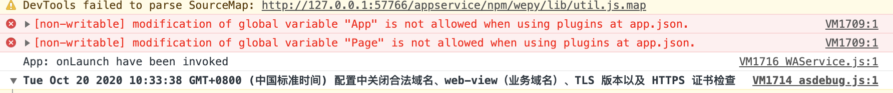

# countly-sdk-wxmp

- Countly微信小程序SDK【[英文参考文档](https://support.count.ly/hc/en-us/articles/360037441932-Web-analytics-JavaScript-)】

## 1、如何使用

* 安装

```
  npm i -S git+https://github.com/zsh3384027/countly-sdk-wxmp.git#tag
```

* 引入

```
  import Countly from '@egova/countly-sdk-wxmp'
```

* 初始化

```
  Countly.q = Countly.q || []
  // mandatory, app key for your app created in Countly
  Countly.app_key = appKey
  // your Countly server URL - you may also use your own server URL or IP here
  Countly.url = url
  Countly.debug = true
  // 页面存活时间记录
  Countly.track_page = true
  // 记录错误日志
  Countly.track_errors = true
  // 会话跟踪
  Countly.q.push(['track_session'])
  new Countly().init()

```

## 2、文件结构

|--lib 编译后代码位置

|--pics readme图片

|--src 源码

|--wepy wepy1.x框架demo

|--native 微信小程序原生demo

## 3、注意事项

1、如果小程序项目中引入了插件，在开发工具中会出现报错，无法监听app和page生命周期方法，但是在真机中是没有限制。



2、小程序原生开发引入npm包

小程序原生开发引入countly-sdk-wxmp的npm包，需要在构建npm包：

点击开发者工具中的菜单栏：工具 --> 构建 npm

点击开发者工具中的菜单栏：详情 --> 本地设置 --> 使用npm模块
